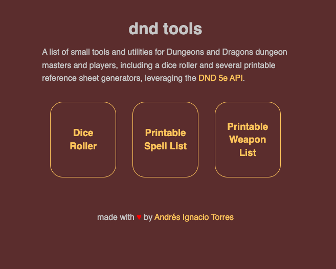

# DnD Tools



**DnD Tools** is a collection of simple tools for Dungeons and Dragons DMs and players, built as a web application using Svelte.

You can access the project [here: DnD Tools](https://dndtools.aitorres.com/) and read more about it [here](https://aitorres.com/projects/dnd-tools/)

## Installation

If you want to install the web application locally, you will need `npm`.

Clone the repository, then run the following to start a development server:

```bash
npm run dev

# or start the server and open the app in a new browser tab
npm run dev -- --open
```

## Deployment

Since the app is a static website, you can run the following `npm` command to build the project.

```bash
npm run build
```

You can preview the production build with `npm run preview`.

Then, just copy the contents of the `build` folder to an appropriate web hosting.

## Contributing

Pull requests are welcome. For major changes, please open an issue first
to discuss what you would like to change.
